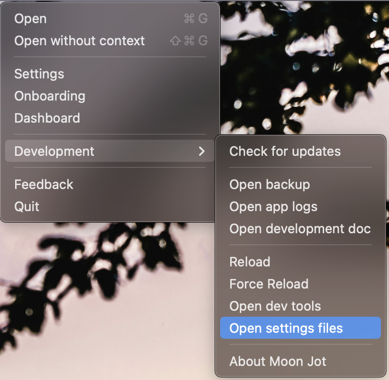

# Plugin Development

Moon Jot is base on a plugin system that make easy to develop your own integration and workflows

Check also the tutorial video https://youtu.be/dvoalnWBwv4

👋 Here a utils library to build Moon Kot plugin https://github.com/castroCrea/moon-utils

# Develop on Moon

1. Clone or Fork repo [https://github.com/castroCrea/moon-sample-plugin](https://github.com/castroCrea/moon-sample-plugin) `git clone https://github.com/castroCrea/moon-sample-plugin.git moon-name-of-your-plugin`
2. Install repo with `yarn` 
3. Modify plugin name on `package.json`
4. You are ready to develop (Note that everything is typed with typescript)

## Continue with Live development

5. Go to Moon Jot `Menu > Development > Open Settings File`
  <p align="center">
    
  </p>

6. In there in the `settings.plugins.list` array add the following code 
    ```json
    {
      "id": 1000000000,
      "name": "Name of the app",
      "packageName": "{PATH_TO_PLUGIN_ROOT }",
      "description": "Sample app",
      "fromPath": true,
      "devMode": true
    }
    ```
    [More explanation bellow](#plugin-settings-explanation)

7. Activate dev mode in Moon Jot. Go to `Menu > Settings > Enable Dev Mode`
  <p align="center">
    
  </p>
8. Go back on your plugin and start building on every change `yarn watch`
9. You are good to go.

🚨 It can be possible that you need to reopen settings to see plugins changes. (I'm working on improving that).
🚨 When adding to the settings a plugin, it can be possible that on new plugin installation, you need to restart the Moon Jot to see it in the plugin.


## Plugin settings explanation
Add this with the path to your plugins to `/Users/{USER_NAME}/Library/Application Support/moon.jot/moon-settings.json` in the you `settings.plugins.list` array
```json
{
  "id": 1000000000, // uniq id all over that app (to get in the store, Moon jot will automatically give you one)
  "name": "Name of the app",
	"packageName": "{PATH_TO}/moon-sample-plugin", // path to the plugin
	"description": "Sample app",
	"fromPath": true, // if you packages name is develop locally
	"devMode": true, // allow auto refresh before each use
  "npmRegistryUrl": "https://npm.pkg.github.com", // if you use GITHUB as registry (otherwise you can remove that if npm)
  "npmRegistryConfig": {
    "auth": {
      "token": "GITHUB_TOKEN_IF_DEV_PRIVATE" // if GITHUB is the registry
    }
  }
}
```

## Useful commands

```bash
// Watch change and build on every file change (development user)
yarn watch

// Build and Publish to npm
yarn pub

// Trigger linter
yarn lint
```

## Videos

🙋 Check YouTube **Permissions** videos: https://www.youtube.com/playlist?list=PLmTKOO83vuwX7rit8WLxlnAbfIYy2aAwU

✨ Check YouTube **Features** videos: https://www.youtube.com/playlist?list=PLmTKOO83vuwVnQbCVjCuxUrfyaiLPgmvn
